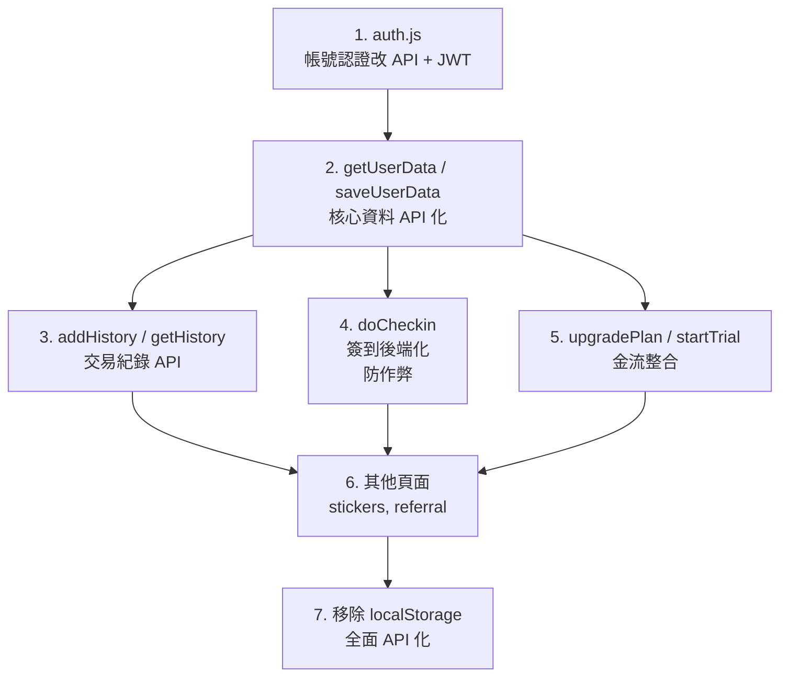

# 📐 譯保通 商業化訂閱系統 — 架構文件

> 最後更新：2026-02-14

---

## 一、檔案總覽

| 檔案 | 用途 | 行數 |
|------|------|------|
| `auth.js` | **共用核心模組**，提供帳號認證、資料讀寫、統一 Header、跨分頁同步 | 596 |
| `subscription.html` | 會員訂閱方案頁（Free / Basic / Pro） | 1127 |
| `wallet.html` | Coins 錢包頁：餘額、簽到、看廣告、購買套餐、交易紀錄 | 1095 |
| `checkin.html` | 每日蓋章簽到頁：15 天印章卡、獎勵發放、補簽機制 | 1426 |
| `ai-consult.html` | AI 保險諮詢聊天頁：額度管理、對話 UI | 1025 |
| `stickers.html` | 貼圖商城：解鎖、看廣告 / 花幣解鎖 | 1067 |
| `referral.html` | 推薦好友頁：推薦碼、里程碑獎勵、成就徽章 | 1192 |
| `profile.html` | 個人檔案頁：頭像上傳、暱稱編輯、成就、交易紀錄 | 823 |

---

## 二、各檔案功能區塊對照表

### 2.1 `auth.js` — 共用認證核心

| 區塊 | 行數 | 說明 |
|------|------|------|
| **使用者清單管理** | L22–56 | `getLocalUsers()`, `saveLocalUsers()`, `findUserByUsername()`, `registerLocalUser()`, `loginLocalUser()`, `ensureLocalDemoUser()` — 管理 localStorage 帳號清單 |
| **認證狀態** | L58–81 | `getAuthenticatedUser()`, `setAuthenticatedUser()`, `isLoggedIn()`, `logoutUser()` — 管理當前登入者 |
| **使用者資料 (user-keyed)** | L82–143 | `_DEFAULT_USER_DATA`, `_getUserDataKey()`, `getUserData()`, `saveUserData()`, `getHistory()`, `addHistory()` — 讀寫個人 coins、VIP、連簽、交易紀錄 |
| **頭像管理** | L145–156 | `getAvatar()`, `saveAvatar()` — base64 存取頭像 |
| **暱稱更新** | L158–178 | `updateDisplayName()` — 修改顯示名稱並同步 header |
| **AI 額度管理** | L180–201 | `getAiDailyLimit()`, `ensureDailyReset()` — 每日 AI 使用額度 |
| **Auth Gate UI** | L203–214 | `initAuthGate()` — 檢查登入並呼叫 `showAuthLock()` |
| **統一 Header** | L216–411 | `_injectHeaderStyles()`, `injectHeaderInfo()`, `updateHeaderInfo()` — 注入全站 header bar（🪙 coins / plan badge / 頭像 / 暱稱 / 登出） |
| **登入鎖定頁** | L413–547 | `showAuthLock()` — 全頁面覆蓋的登入 / 註冊表單 |
| **跨分頁同步** | L548–596 | `storage` event + `setInterval` 輪詢 — 偵測 localStorage 變化並更新 header |

---

### 2.2 `wallet.html` — 錢包頁

| 區塊 | 行數 | 說明 |
|------|------|------|
| CSS 樣式 | L9–722 | 設計 token、Hero、Streak 卡片、套餐卡片、交易紀錄排版 |
| HTML 結構 | L726–830 | Header + Hero（餘額）+ 簽到卡片 + 看廣告 + 套餐購買 + 交易紀錄 |
| `getTodayStr()` / `isYesterday()` / `isToday()` | L837–856 | 日期工具函式 |
| ⚠️ `renderAll()` | L858–888 | 讀取 `getUserData()` 渲染餘額、streak grid、簽到按鈕、交易紀錄 |
| `renderStreakDays(data)` | L890–921 | 渲染 7 天連簽圓格（✅ / ⬜ / 🎁） |
| `renderHistory()` | L923–945 | 渲染最近 20 筆交易紀錄 |
| `animateCoinGain(amount)` | L947–963 | 硬幣增加動畫（+N 🪙 浮動） |
| ⚠️ `doCheckin()` | L965–1014 | 簽到：更新 streak, coins, history，**同步至 `checkin_data_*`** |
| `watchAd()` | L1019–1065 | 模擬看廣告 +3 coins |
| `buyPackage(coins, price)` | L1067–1078 | 模擬購買幣包 |
| `showToast(icon, msg)` | L1080–1087 | Toast 通知 |

---

### 2.3 `checkin.html` — 簽到蓋章頁

| 區塊 | 行數 | 說明 |
|------|------|------|
| CSS 樣式 | L9–861 | 印章卡片、格子動畫、杯子圖片（`stamp-cup`）、Milestone |
| HTML 結構 | L865–968 | Header + Hero + 15 天蓋章卡 + 里程碑 + 獎勵說明 + 補簽 modal |
| ⚠️ `_checkinKey()` / `getCheckinData()` / `saveCheckinData()` | L970–987 | 獨立的 `checkin_data_*` localStorage 讀寫 |
| `createFreshCheckinData()` | L989–1000 | 初始蓋章卡結構（15 天 stamps, streak, current_day 等） |
| 日期工具 | L1002–1018 | `getTodayStr()`, `daysBetween()`, `isToday()` |
| `DAY_CONFIG[]` | L1022–1037 | 15 天獎勵設定：coins / ai / sticker / milestone / mega |
| ⚠️ `initCard()` | L1089–1142 | 初始化集章卡、偵測 wallet 同步、標記漏簽天數 |
| ⚠️ `renderAll()` | L1145–1230 | 渲染蓋章格子（使用 `空.png` / `滿.png` 杯子圖片）、按鈕狀態 |
| ⚠️ `doCheckin()` | L1233–1275 | 蓋章：更新 stamps, streak, `checkinData`，**同步至 `user_data_*`** |
| ⚠️ `grantDayReward(dayIdx, streak)` | L1277–1310 | 根據 `DAY_CONFIG` 發獎勵（coins / AI / 貼圖 / 大獎） |
| `unlockRandomSticker()` | L1312–1325 | 隨機解鎖一張貼圖 |
| `openMakeupModal(i)` / `doMakeup()` | L1327–1400 | 補簽功能（看廣告補蓋） |

---

### 2.4 `subscription.html` — 訂閱方案頁

| 區塊 | 行數 | 說明 |
|------|------|------|
| CSS 樣式 | L9–759 | Pricing 卡片、比較表 |
| HTML 結構 | L763–960 | Header + Hero + 目前方案 + 三方案卡片 + 功能比較表 |
| ⚠️ `renderAll()` | L980–999 | 讀取 `getUserData()` 渲染目前方案、AI 額度、coins |
| ⚠️ `updatePricingUI(level)` | L1001–1030 | 根據 VIP 等級更新三張定價卡（當前方案 / 可升級） |
| ⚠️ `upgradePlan(plan)` | L1032–1057 | 模擬升級：設定 `vip_level`, 發 coins 獎勵 |
| `showTrialModal(plan)` | L1059–1085 | 7 天試用 modal |
| ⚠️ `startTrial(plan)` | L1087–1100 | 模擬開始試用：設定 VIP |

---

### 2.5 `ai-consult.html` — AI 諮詢頁

| 區塊 | 行數 | 說明 |
|------|------|------|
| CSS 樣式 | L9–668 | 聊天介面 UI |
| HTML 結構 | L672–768 | Header + Quota 欄 + 聊天訊息區 + 發送欄 + 超額 modal |
| `getRemainingQuota()` / `getTotalLimit()` | L777–784 | 計算剩餘 AI 次數 |
| ⚠️ `renderUI()` | L786–824 | 更新額度進度條、coins、按鈕狀態 |
| `AI_RESPONSES[]` | L827–836 | 模擬 AI 回覆文字 |
| ⚠️ `handleSend()` | L884–928 | 發送訊息：扣 AI 額度、deduct coins（VIP 免費 / Free 需花幣） |
| `addMessage()` / `addTyping()` | L850–882 | DOM 操作：訊息氣泡 |
| ⚠️ `closeQuotaModal()` / `buyCoinQuota()` | L930–970 | 超額處理：花 5 coins 買 1 次 AI |

---

### 2.6 `stickers.html` — 貼圖商城

| 區塊 | 行數 | 說明 |
|------|------|------|
| CSS 樣式 | L9–691 | 貼圖卡片、解鎖動畫、modal |
| HTML 結構 | L695–790 | Header + Hero + Filter 列 + 貼圖網格 + 解鎖 modal + 廣告覆蓋層 |
| `STICKERS[]` | L796–812 | 16 張貼圖設定（id, emoji, name, vip） |
| ⚠️ `_unlockKey()` / `getUnlocked()` / `saveUnlocked()` | L818–831 | 使用者貼圖解鎖狀態（`stickers_<uid>`） |
| `unlockSticker(id)` | L837–843 | 解鎖一張貼圖到本地 |
| ⚠️ `renderHeader()` | L845–854 | 更新 header coins |
| `renderGrid()` | L871–909 | 渲染所有貼圖卡片 |
| ⚠️ `showUnlockModal(id)` | L911–930 | 彈出解鎖 modal |
| ⚠️ `doAdUnlock()` / `doCoinUnlock()` | L932–990 | 看廣告解鎖 / 花 10 coins 解鎖 |

---

### 2.7 `referral.html` — 推薦好友頁

| 區塊 | 行數 | 說明 |
|------|------|------|
| CSS 樣式 | L9–752 | 推薦卡片、進度條、成就徽章 |
| HTML 結構 | L756–847 | Header + Hero + 推薦碼 + 模擬按鈕 + 里程碑 + 徽章 + 推薦紀錄 |
| `TIERS[]` / `BADGES[]` | L852–871 | 里程碑等級設定 + 成就徽章定義 |
| ⚠️ `_refKey()` / `getReferralData()` / `saveReferralData()` | L879–896 | 推薦資料 localStorage 讀寫（`referral_<uid>`） |
| `generateCode()` | L907–913 | 產生隨機推薦碼 |
| ⚠️ `simulateReferral()` | L1051–1100 | 模擬推薦成功：+10 coins、更新推薦計數 |
| `renderTiers()` / `renderBadges()` / `renderHistory()` | L982–1049 | 渲染里程碑、徽章、紀錄 |

---

### 2.8 `profile.html` — 個人檔案頁

| 區塊 | 行數 | 說明 |
|------|------|------|
| CSS 樣式 | L8–554 | 暗色主題、頭像框、資料卡片、徽章格 |
| HTML 結構 | L558–636 | Header + 頭像區 + 暱稱 + VIP badge + 資料卡片 + 徽章 + 交易紀錄 |
| `BADGES[]` | L639–651 | 12 個成就徽章定義 |
| ⚠️ `renderProfile()` | L654–693 | 讀取 `getUserData()`, `getAvatar()` 渲染全頁 |
| `renderBadges(data)` | L695–710 | 渲染成就徽章 |
| `renderHistory()` | L712–736 | 渲染近 10 筆交易紀錄 |
| ⚠️ Avatar Upload | L738–769 | `<input type="file">` → Canvas resize → `saveAvatar()` |
| ⚠️ Nickname Edit | L774–810 | 彈出 modal → `updateDisplayName()` |

---

## 三、localStorage 資料結構總覽

| Key 格式 | 所屬頁面 | 內容 |
|----------|----------|------|
| `localUsers` | auth.js | 所有註冊帳號陣列 `[{ id, displayName, username, password }]` |
| `authUser` | auth.js | 當前登入者 JSON `{ id, displayName, username }` |
| `userAuthed` | auth.js | 是否已認證 `'true'` |
| `user_data_<uid>` | auth.js → 全頁共用 | 使用者核心資料 `{ coins, vip_level, streak, last_checkin, daily_ai_used, ... }` |
| `history_<uid>` | auth.js → 全頁共用 | 交易紀錄陣列 `[{ type, label, amount, time }]` |
| `avatar_<uid>` | auth.js | 頭像 base64 字串 |
| `checkin_data_<uid>` | checkin.html | 蓋章卡 `{ stamps[], current_day, streak, last_checkin, week_start, ... }` |
| `stickers_<uid>` | stickers.html | 已解鎖貼圖 ID 陣列 `['s01', 's03', ...]` |
| `referral_<uid>` | referral.html | 推薦資料 `{ code, count, history[], claimed_tiers[] }` |

---

## 四、遷移至網路資料庫 — 修改指南

> 以下標示 ⚠️ 的函式是遷移時**必須修改**的區塊。

### 4.1 核心原則

```
[前端 localStorage]  →  [後端 API + 資料庫]
      同步讀寫               非同步 (async/await)
      無延遲                 有網路延遲
      無驗證                 JWT / Session Token
```

遷移後，`auth.js` 中的所有資料存取函式需改為 `async` 並呼叫 REST API。各頁面的 `renderAll()` 等函式也需改為 `async` 或使用 `.then()` 串接。

---

### 4.2 `auth.js` 需修改的函式

| 函式 | 目前做法 | 遷移做法 | 行數 |
|------|----------|----------|------|
| `getLocalUsers()` | `localStorage.getItem('localUsers')` | **刪除**，改為 API 登入驗證 | L22–25 |
| `saveLocalUsers()` | `localStorage.setItem(...)` | **刪除** | L26 |
| `registerLocalUser()` | 寫入 localStorage | `POST /api/auth/register` | L33–40 |
| `loginLocalUser()` | 比對 localStorage | `POST /api/auth/login` → 取得 JWT | L42–47 |
| `getAuthenticatedUser()` | `localStorage.getItem('authUser')` | 從 JWT decode 或 `GET /api/auth/me` | L58–61 |
| `setAuthenticatedUser()` | `localStorage.setItem('authUser')` | 儲存 JWT token | L63–71 |
| `logoutUser()` | `localStorage.removeItem(...)` | `POST /api/auth/logout` + 清 token | L77–81 |
| ⚠️ `getUserData()` | `localStorage.getItem('user_data_<uid>')` | `GET /api/user/data` | L107–120 |
| ⚠️ `saveUserData()` | `localStorage.setItem(...)` | `PUT /api/user/data` | L122–125 |
| ⚠️ `getHistory()` | `localStorage.getItem('history_<uid>')` | `GET /api/user/history` | L127–130 |
| ⚠️ `addHistory()` | push to array + localStorage | `POST /api/user/history` | L132–143 |
| `getAvatar()` | `localStorage.getItem('avatar_<uid>')` | `GET /api/user/avatar` (URL) | L145–150 |
| `saveAvatar()` | `localStorage.setItem(...)` | `POST /api/user/avatar` (file upload) | L152–156 |
| `updateDisplayName()` | 修改 localStorage 多處 | `PUT /api/user/profile` | L158–178 |
| `ensureDailyReset()` | 本地日期比對 + 重置 | 後端 cron job 或 API 呼叫時自動重置 | L188–201 |

---

### 4.3 各頁面需修改的函式

#### `wallet.html`

| 函式 | 修改方式 | 行數 |
|------|----------|------|
| `renderAll()` | 改為 `async`，`await getUserData()` | L858–888 |
| `doCheckin()` | 改為 `POST /api/checkin`，由後端統一處理 coins + streak + checkinData | L965–1014 |
| `watchAd()` | `POST /api/ad/reward` — 後端驗證廣告完成 | L1019–1065 |
| `buyPackage()` | `POST /api/purchase` — 後端處理金流 + 加幣 | L1067–1078 |

#### `checkin.html`

| 函式 | 修改方式 | 行數 |
|------|----------|------|
| `getCheckinData()` / `saveCheckinData()` | 改為 `GET/PUT /api/checkin/data` | L976–987 |
| `initCard()` | 改為 `async`，從 API 取蓋章卡狀態 | L1089–1142 |
| `doCheckin()` | `POST /api/checkin` — 後端統一處理 | L1233–1275 |
| `grantDayReward()` | 移至**後端**處理（防作弊） | L1277–1310 |
| `doMakeup()` | `POST /api/checkin/makeup` | L1370–1400 |

#### `subscription.html`

| 函式 | 修改方式 | 行數 |
|------|----------|------|
| `upgradePlan()` | `POST /api/subscription/upgrade` — 金流 + 後端 VIP 設定 | L1032–1057 |
| `startTrial()` | `POST /api/subscription/trial` — 後端設定試用期限 | L1087–1100 |
| `renderAll()` | `async` + API 取方案狀態 | L980–999 |

#### `ai-consult.html`

| 函式 | 修改方式 | 行數 |
|------|----------|------|
| `handleSend()` | `POST /api/ai/chat` — 後端呼叫 AI、扣額度、扣幣 | L884–928 |
| `renderUI()` | `async` + API 取剩餘額度 | L786–824 |
| `buyCoinQuota()` | `POST /api/ai/buy-quota` | L930–970 |

#### `stickers.html`

| 函式 | 修改方式 | 行數 |
|------|----------|------|
| `getUnlocked()` / `saveUnlocked()` | `GET/PUT /api/stickers/unlocked` | L825–831 |
| `doAdUnlock()` / `doCoinUnlock()` | `POST /api/stickers/unlock` | L932–990 |

#### `referral.html`

| 函式 | 修改方式 | 行數 |
|------|----------|------|
| `getReferralData()` / `saveReferralData()` | `GET/PUT /api/referral/data` | L885–896 |
| `simulateReferral()` | 改為真實推薦流程 `POST /api/referral/apply` | L1051–1100 |

#### `profile.html`

| 函式 | 修改方式 | 行數 |
|------|----------|------|
| `renderProfile()` | `async` + API | L654–693 |
| Avatar Upload | `POST /api/user/avatar` (multipart) | L738–769 |
| Nickname Edit | `PUT /api/user/profile` | L774–810 |

---

### 4.4 建議後端 API 設計

```
POST   /api/auth/register       { displayName, username, password }
POST   /api/auth/login           { username, password } → { token }
GET    /api/auth/me              → { id, displayName, username }
POST   /api/auth/logout

GET    /api/user/data            → { coins, vip_level, streak, ... }
PUT    /api/user/data            { coins, vip_level, ... }
PUT    /api/user/profile         { displayName }
GET    /api/user/avatar          → image URL
POST   /api/user/avatar          (file upload)
GET    /api/user/history         → [{ type, label, amount, time }]
POST   /api/user/history         { type, label, amount }

POST   /api/checkin              → { reward, streak, stamps }
GET    /api/checkin/data         → { stamps, current_day, ... }
POST   /api/checkin/makeup       { dayIndex }

POST   /api/subscription/upgrade { plan }
POST   /api/subscription/trial   { plan }

POST   /api/ai/chat              { message } → { reply, remaining }
POST   /api/ai/buy-quota

GET    /api/stickers/unlocked    → ['s01', 's03', ...]
POST   /api/stickers/unlock      { id, method: 'ad'|'coin' }

GET    /api/referral/data        → { code, count, history }
POST   /api/referral/apply       { referralCode }

POST   /api/ad/reward            { type: 'coins'|'makeup'|'sticker' }
POST   /api/purchase             { packageId }
```

---

### 4.5 遷移優先順序建議



### 4.6 注意事項

1. **同步 → 非同步**：所有 `getUserData()` 呼叫需改為 `async/await`，影響全部 `renderAll()`
2. **防作弊**：coins 增減、VIP 升級、獎勵發放務必在**後端**執行，前端僅顯示結果
3. **跨分頁同步**：目前靠 `storage` event，遷移後改用 WebSocket 或輪詢 API
4. **離線容錯**：可保留 localStorage 作為快取層（cache），API 回應後覆蓋
5. **頭像上傳**：從 base64 localStorage 改為 file upload + CDN URL
6. **JWT 儲存**：建議放 `httpOnly cookie`，避免 XSS 竊取
