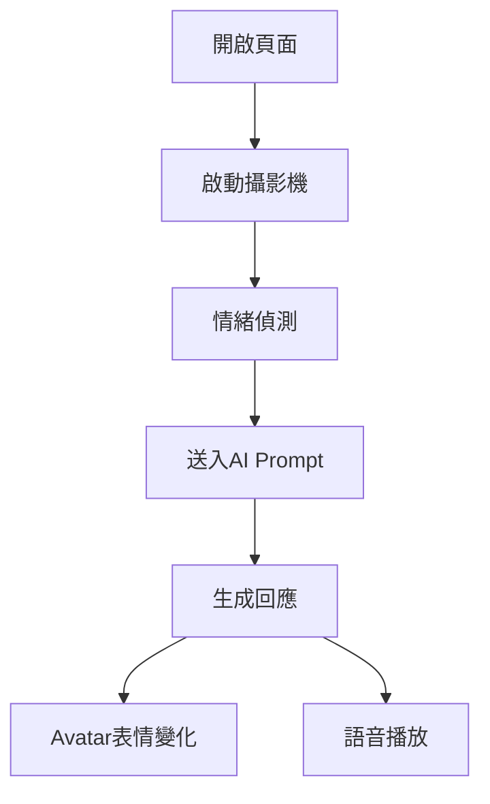

# 🧠 AI對話整合 + 虛擬人物擬人化 開發方案

---

## 🎯 專案目標

本次改造目標分為兩大核心：

### 1️⃣ 介面整合
- 將「AI對話框」與「情緒偵測頁面」整合成單一頁面
- 避免使用者需要切換頁面
- 提升互動流暢度與沉浸感

### 2️⃣ AI擬人化升級
- 建立「虛擬人物（Avatar）」
- 支援「即時視訊對話」
- 根據使用者情緒做出反應（表情 / 語氣 / 回應）

---

## 🏗️ 系統架構調整

### 🔹 前端（Frontend）

#### 原本
- chat.html（聊天）
- emotion.html（情緒辨識）

#### 修改後
- unified-chat.html（整合頁面）

#### 新增模組
- webcam stream（攝影機串流）
- emotion overlay（情緒標記）
- avatar canvas / video container（虛擬人物顯示）

---

### 🔹 後端（Backend）

#### 新增 API
- `/api/emotion-detect`
- `/api/avatar-response`
- `/api/realtime-chat`

#### 整合邏輯
- 情緒 → prompt injection
- prompt → AI回應
- AI回應 → Avatar表情/語音

---

## 🧩 功能拆解

### 🧠 1. 情緒偵測整合

#### 技術建議
- face-api.js 或 MediaPipe

#### 流程
1. 開啟攝影機
2. 偵測臉部
3. 分析情緒（happy / sad / angry / neutral）
4. 每 X 秒更新一次

#### 傳遞格式
```json
{
  "emotion": "happy",
  "confidence": 0.87
}
```

---

### 💬 2. AI對話整合

#### Prompt設計（核心）

```txt
你是一位具備情緒感知能力的AI保險顧問。
使用者目前的情緒是：{emotion}

請根據以下規則回應：
- 若使用者悲傷：語氣溫柔、安撫
- 若使用者開心：語氣活潑
- 若使用者生氣：避免衝突、降低語氣
- 若中性：維持專業

請保持擬人化對話。
```

---

### 🧍 3. 虛擬人物（Avatar）

#### 技術選項

##### 🟢 簡單版
- Live2D
- Lottie動畫

##### 🟡 中階
- Three.js + 3D模型

##### 🔴 進階（推薦）
- Ready Player Me + WebRTC
- 或使用 D-ID / HeyGen API

---

### 🎥 4. 視訊整合（重點）

#### 架構
- 使用 WebRTC

#### 功能
- 顯示使用者攝影機
- 顯示 AI Avatar（影片或canvas）
- 支援語音輸入 / 輸出

---

### 🔊 5. 語音系統

#### STT（語音轉文字）
- Web Speech API

#### TTS（文字轉語音）
- ElevenLabs / Azure TTS

---

## 🔄 整體流程



---

## 🤖 Windsurf 使用 Prompt（重點）

### 🧩 任務1：整合頁面

```txt
請將專案中的 chat.html 與 emotion.html 合併為 unified-chat.html。

需求：
1. 左側顯示攝影機畫面（含情緒偵測）
2. 右側為AI聊天視窗
3. 下方保留輸入框
4. 使用現有CSS風格
5. 確保功能不破壞
```

---

### 🧩 任務2：加入情緒影響AI

```txt
請修改聊天邏輯：

1. 每次送出訊息時附帶 emotion 狀態
2. 將 emotion 加入 system prompt
3. 根據 emotion 改變回應語氣
```

---

### 🧩 任務3：Avatar系統

```txt
請新增一個 Avatar 元件：

需求：
1. 可根據 emotion 切換表情
2. 可播放語音
3. 支援未來串接3D模型
```

---

### 🧩 任務4：語音互動

```txt
請加入語音功能：

1. 麥克風輸入 → 文字
2. AI回應 → 語音播放
3. UI顯示錄音狀態
```

---

## ⚠️ 風險與注意事項

- 情緒偵測準確率有限
- WebRTC 需要 HTTPS
- TTS可能有延遲
- Avatar效能問題（需優化）

---

## 🚀 建議開發順序

1. 先做「頁面整合」
2. 再做「情緒→AI prompt」
3. 再做「Avatar UI」
4. 最後做「語音 + 視訊」

---

## ✅ 最終成果

完成後將會變成：

👉 一個「可視訊 + 有表情 + 會講話 + 懂情緒」的AI顧問系統

---

