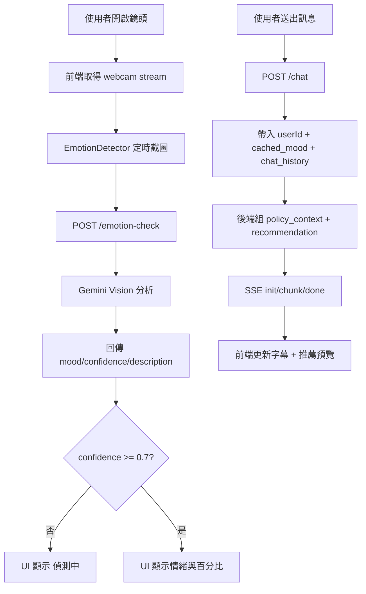

# 面容工具：現行系統設計與開發參考

## 1. 文件目的
本文件用於說明目前「面容情緒工具」在專案中的設計架構、資料流與使用方式，作為後續新功能開發、除錯與交接的基準文件。

適用情境：
- 新功能開發前快速理解現況
- 排查情緒辨識、聊天串流、語音輸入相關問題
- 釐清前端與後端責任邊界

## 2. 系統目標與使用目的
面容工具的核心目標是：
- 透過鏡頭持續擷取使用者影像，做「臉部情緒」背景辨識
- 在不拖慢對話體驗下，把情緒結果作為 AI 回覆語氣的輔助訊號
- 提供可視化狀態（左上鏡頭區）給使用者即時確認偵測狀態

目前定位：
- 左上角狀態是「臉部情緒」，不是聲音情緒
- 語音情緒屬於 `/chat` 音訊分析結果（voice_mood/tone/urgency），不在左上角顯示

## 3. 架構總覽

### 3.1 主要元件
- 前端頁面：`frontend/pages/consulting.html`
- 前端情緒模組：`frontend/components/unified-chat-components/emotion-detector.js`
- 後端主服務（Face Backend, Port 8000）：`backend/services/face_backend/main.py`
- 臉部情緒推論（Gemini Vision）：`backend/services/face_backend/vision_client.py`
- 語音轉文字與回覆生成（Gemini）：`backend/services/face_backend/gemini_client.py`
- 啟動器：`scripts/launchers/face_launcher.ps1`

### 3.2 邏輯分層
- UI 層（consulting.html）：
  - 啟動/關閉鏡頭
  - 顯示臉部情緒狀態
  - 傳送聊天與接收串流回覆
- 前端服務層（EmotionDetector）：
  - 定時截圖
  - 呼叫 `/emotion-check`
  - 更新狀態文字與指示燈
- 後端 API 層（FastAPI）：
  - `/emotion-check`：臉部情緒分析
  - `/chat`：整合文字/語音/情緒，回傳 SSE 串流
- 模型層（Gemini）：
  - Vision：臉部情緒
  - Audio + Text：語音轉文字、語氣情緒、回覆生成

## 4. 資料夾結構（與面容工具直接相關）

```text
重新設計版面樣式/
  frontend/
    pages/
      consulting.html
    components/
      unified-chat-components/
        emotion-detector.js
        ai-chat.js
        avatar-system.js
        voice-module.js
        voice-tts-module.js
  backend/
    services/
      face_backend/
        main.py
        vision_client.py
        gemini_client.py
        README.md
        requirements.txt
  scripts/
    launchers/
      face_launcher.ps1
```

## 5. API 設計（現況）

### 5.1 `POST /emotion-check`（Port 8000）
用途：背景輪詢臉部情緒，不阻塞主聊天流程。

輸入：
- `image`（FormData）：base64 截圖（可含或不含 data URL prefix）

輸出（成功）：
- `mood`: `happy|neutral|curious|confused|worried|nervous|sad|unknown|cooldown`
- `description`: 繁中描述
- `confidence`: 0.0~1.0

保護機制：
- 有全域 cooldown（約 2.5 秒）避免打爆 Vision API

### 5.2 `POST /chat`（Port 8000, SSE）
用途：處理文字/語音輸入，整合情緒與歷史紀錄後回覆。

輸入（Form）：
- `text` 或 `audio`
- `userId`（目前登入使用者 ID，供後端查詢使用者保單摘要）
- `images`（可選）
- `skip_vision`（前端主流程目前為 `true`）
- `cached_mood`
- `chat_history`（JSON 字串）

後端組裝重點：
- 先以 `userId` 透過 node-server 摘要 API 取得使用者保單候選（不帶 PDF/base64）
- 合併平台保單快取候選，組成 `policy_context`
- 進一步產生 `ranked_policy_candidates` 與 `recommendation_meta`
- 若摘要 API timeout 或空資料，回退空推薦，不中斷 SSE

輸出（SSE 事件）：
- `type=init`：先回傳當前 user_text + emotion + voice + recommendation payload
- `type=chunk`：逐段 AI 回覆文字
- `type=done`：流程完成與耗時

## 6. 核心流程（一步一步）

### 6.1 流程 A：開啟鏡頭與臉部情緒背景偵測
1. 使用者點「開啟鏡頭」。
2. 前端取得 `getUserMedia()` stream 並綁到 `#user-webcam`。
3. `EmotionDetector.startEmotionAnalysis()` 開始定時任務（現為約 4 秒一次）。
4. 每次循環：
   - 用 hidden canvas 擷取當前影像
   - 轉成 JPEG base64
   - 呼叫 `POST /emotion-check`
5. 前端接收 `mood/confidence/description` 後更新：
   - 左上角情緒膠囊文字
   - 顏色指示燈
6. 若信心不足（< 0.7）或結果 `unknown`：
   - 顯示「偵測中」
   - 避免誤導性情緒標籤

### 6.2 流程 B：使用者送出問題到 AI
1. 使用者輸入文字（或語音轉文字後）送出。
2. 前端送 `POST /chat`，並帶上：
  - `userId`
   - `skip_vision=true`
   - `cached_mood=目前前端快取情緒`
   - `chat_history=最近對話`
3. 後端先組 `policy_context`（平台 + 使用者保單候選）與推薦排序資料。
4. 後端回 `init` 事件，前端即刻刷新狀態並更新推薦預覽。
5. 後端用 Gemini 逐段產出回覆，前端持續接 `chunk` 更新字幕/聊天內容。
6. `done` 事件到達後，完成本次回合。

### 6.3 流程圖



## 7. 目前現有功能
- 臉部情緒背景偵測（左上鏡頭區）
- 低信心保護（低信心顯示「偵測中」）
- 鏡頭狀態與情緒提示文字同步
- 主對話走 SSE 串流（較即時）
- 聊天帶入歷史紀錄（維持上下文）
- 語音分析有門檻控制（避免低信心污染語氣）
- 已關閉舊版隨機情緒 fallback（避免假精準）

## 8. 可能成效（現階段）
- 對話更貼近使用者當下狀態（但不過度依賴情緒）
- UI 可快速回饋鏡頭是否有效辨識
- 降低「錯誤情緒高亮」造成的誤解
- 保持主聊天延遲可控（透過 skip_vision + cached_mood）

## 9. 已知限制與風險
- 臉部情緒辨識非醫療級，受光線/角度/遮擋影響大。
- 表情是瞬時訊號，不等於真實心理狀態。
- 若 Gemini API 不可用，情緒與回覆能力會降級。
- 前端與後端目前有部分舊版相容邏輯，未完全清理。

## 10. 如何使用（開發/測試）

### 10.1 啟動方式
1. 設定 `GEMINI_API_KEY`。
2. 安裝 `backend/services/face_backend/requirements.txt`。
3. 啟動 face backend（建議用啟動器）：
   - `scripts/launchers/face_launcher.ps1`
4. 確認 `http://localhost:8000/health` 與 `http://localhost:8000/config`。
5. 開啟 `consulting.html` 進入功能頁。

### 10.2 驗收重點
- 鏡頭開啟後左上角顯示有變化
- 低信心時是否顯示「偵測中」
- 發問時是否有收到 SSE chunk 串流
- 關閉鏡頭後是否停止背景偵測

## 11. 後續開發建議（新功能參考）

### 11.1 建議擴充方向
- 情緒平滑策略（最近 N 次投票）降低抖動
- 多模態融合權重可配置（臉部 vs 語音 vs 文字）
- 加入開發者診斷面板（顯示 raw confidence 與來源）
- 建立情緒事件紀錄（匿名化）用於品質評估

### 11.2 擴充時的修改入口
- 前端情緒顯示與門檻：`emotion-detector.js`
- 主對話參數與 SSE 處理：`consulting.html`（`ConsultingController`）
- 臉部情緒判讀提示詞：`vision_client.py`
- 語音情緒門檻與回覆策略：`main.py` + `gemini_client.py`

## 12. 維護原則
- 情緒只作為「語氣輔助」，不要主導內容正確性。
- 低信心寧可顯示「偵測中」，不要輸出看似精準的錯誤標籤。
- 任何 fallback 不可使用隨機結果冒充正式推論。
- 新增功能前，先確認不影響聊天主流程延遲與穩定性。

---

最後更新：2026-03-27
維護建議：若調整 API 欄位、門檻值、或 UI 顯示文案，請同步更新本文件第 5~7 章。
